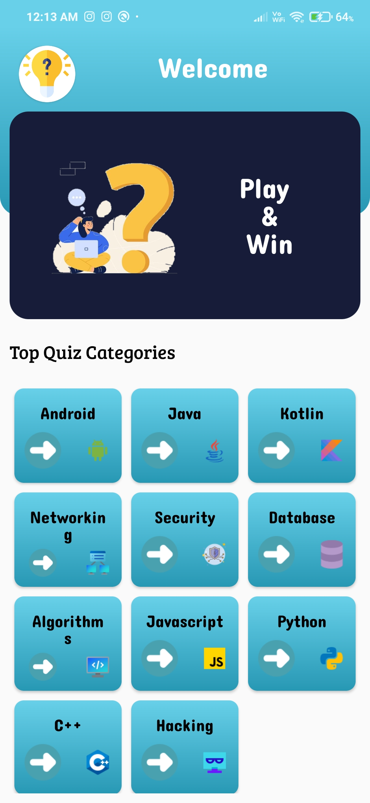
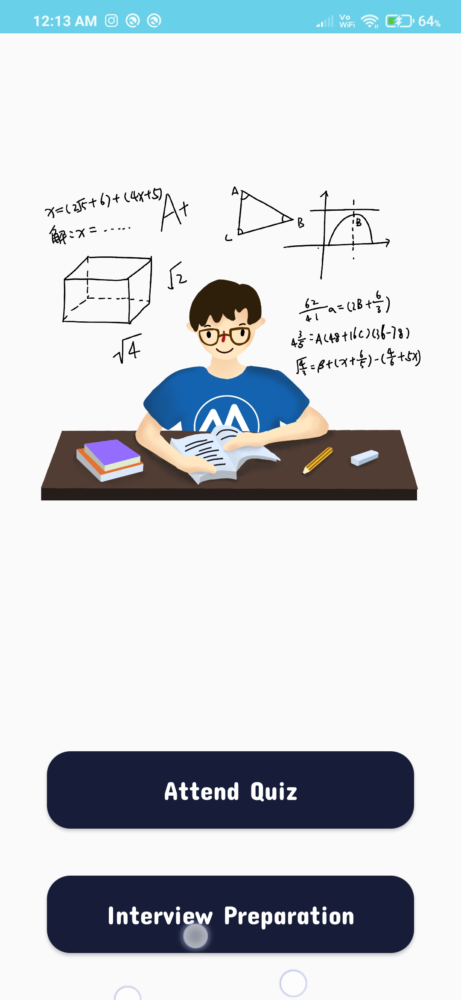
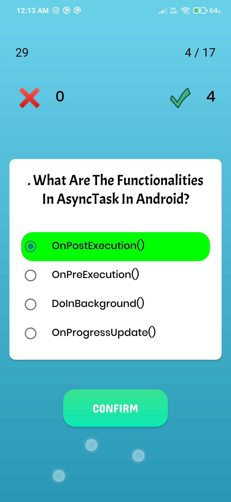

# Quiziva: coding and interview
*Quiziva app attempts quizzes in 10+ technologies such as Java, Hacking, Android Development, Kotlin, Python, JavaScript, and much more. Attempt various quizzes to test and enhance your programming skills.*

#### Kotlin, Room Database, MVVM, Material Components, 

 
Screenshots
---

  
  
  

Current Features
---
* Multiple Technologies (10+ technologies)
* Absolutely Free
* No Ads
* No SignUp - Download and use right away!
* Quizzes, Interview Preparation
* Offline access
* Interactive Experience
* Simple to use

Planned Features
---
* 💡Topic questions update
* 📃Multiple Topic
* 💡Interview question
* ⏰Timer
* ⚙️Dark Mode /Settings Menu
* 💥Overview customization
* 🎨Themes

Known Issues
---
To report issues, please email me at bhavesh.patil0325@gmail.com.

